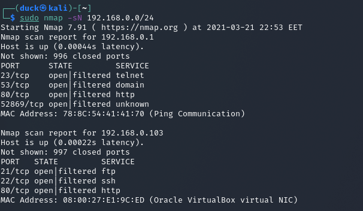
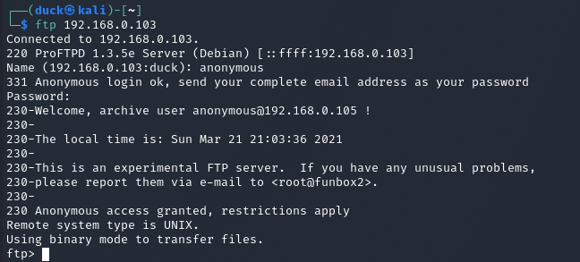
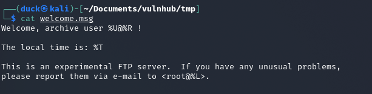

# FunBox2

NETWORK
---------

* scan local IP addresses
    * nmap -sN -sV 192.168.0.0/24
      * `-sN we use for fast scan`
        * `if you want see service names and versions use -sV` 
      * `/24 we describe the lenght of subnet`
    

Here we have ftp, ssh and http ports open. So we will start from ftp port.

FTP
---------

First thing what I tried was "anonymous" - ref. https://stackoverflow.com/questions/3936911/how-can-i-login-anonymously-with-ftp-usr-bin-ftp/20031581

This is the common issue for "beginners". 
In password area I just hit enter.

So we are in. First things what I did, checked current directory and list of files.

Between <b>.zip</b> files I found <b>welcome.msg</b>, so with <b>mget</b> command I managed to download it into local machine.
I check what is inside.

