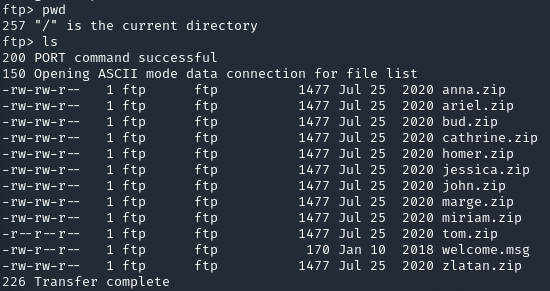
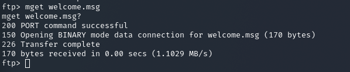
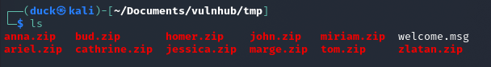
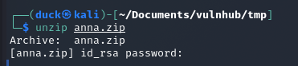
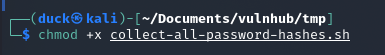
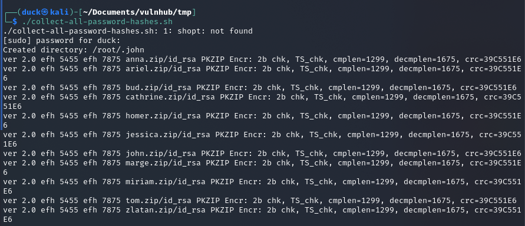
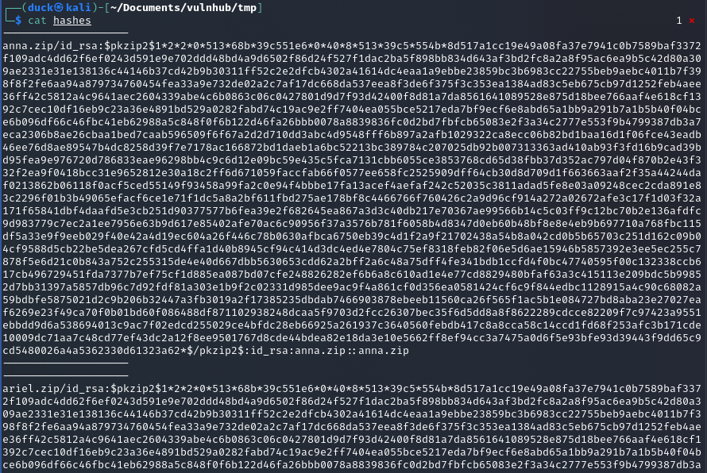
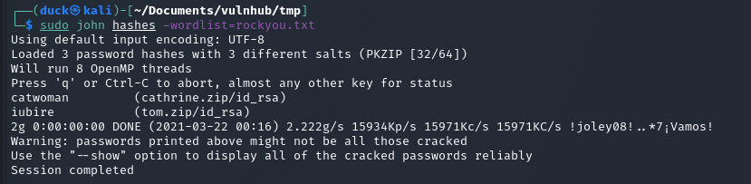

# FunBox2

NETWORK
---------

* scan local IP addresses
    * nmap -sN -sV 192.168.0.0/24
      * `-sN we use for fast scan`
        * `if you want see service names and versions use -sV` 
      * `/24 we describe the lenght of subnet`
    


Here we have ftp, ssh and http ports open. So we will start from ftp port.

FTP
---------

First thing what I tried was "anonymous" - ref. https://stackoverflow.com/questions/3936911/how-can-i-login-anonymously-with-ftp-usr-bin-ftp/20031581

This is the common issue for "beginners". 
In password area I just hit enter.


So we are in. First things what I did, checked current directory and list of files.



Between <b>.zip</b> files I found <b>welcome.msg</b>, so with <b>mget</b> command I managed to download it into local machine.
I check what is inside.




So, at this moment I don't see anything interesting in welcome message.
Because of that, I downloaded all zipped files.



Then I tried to unzip first zipped file "anna", and it seems it requires password.


Maybe John will help us with rockyou.txt list?

IT IS JOHNY TIME
---------

First I created a shell script, to write all hashes into one file. Script you can find in this folder.

```
shopt -s nullglob
for i in *.zip; do
    [ -f "$i" ] || break
    sudo zip2john $i >> hashes
done
```

Then I added executable rights to the shell file.



Then execute it.




After collecting all hashes it is to check if we get some results from wordlist.

`sudo john hashes -wordlist=rockyou.txt`



To be continued...
